# Casos de Teste - SauceDemo
## Objetivo
Validar as principais funcionalidades do sistema SauceDemo, incluindo login, carrinho, checkout e logout.

# Login

# CT-001 — Login com credenciais válidas

## Prioridade
Alta

## Tipo de teste
Funcional

## Pré-condição
Usuário deve estar na página de login do SauceDemo.

## Passos
1. Inserir usuário válido "standard_user"
2. Inserir senha válida "secret_sauce"
3. Clicar no botão "Login"

## Resultado esperado
O sistema deve permitir acesso à página de produtos.

## Resultado obtido
O sistema permitiu acesso corretamente à página de produtos.

## Evidência

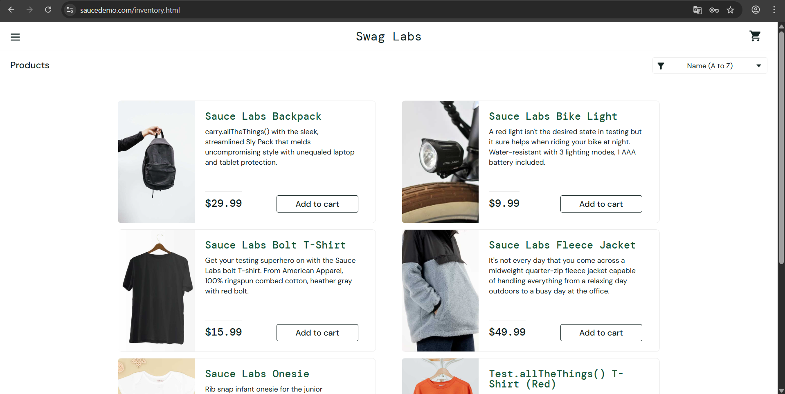

## Status
Aprovado

# CT-002 — Login com usuário inválido

## Prioridade
Alta

## Tipo de teste
Funcional

## Pré-condição
Usuário deve estar na página de login do SauceDemo.

## Passos
1. Inserir usuário inválido "usuario_invalido"
2. Inserir senha válida "secret_sauce"
3. Clicar no botão "Login"

## Resultado esperado
O sistema deve impedir o acesso e exibir uma mensagem de erro ao usuário.

## Resultado obtido
O sistema impediu o acesso corretamente e exibiu mensagem de erro.

Foi identificado um problema visual na mensagem de erro. 
Bug relacionado: BUG-001.

## Evidência

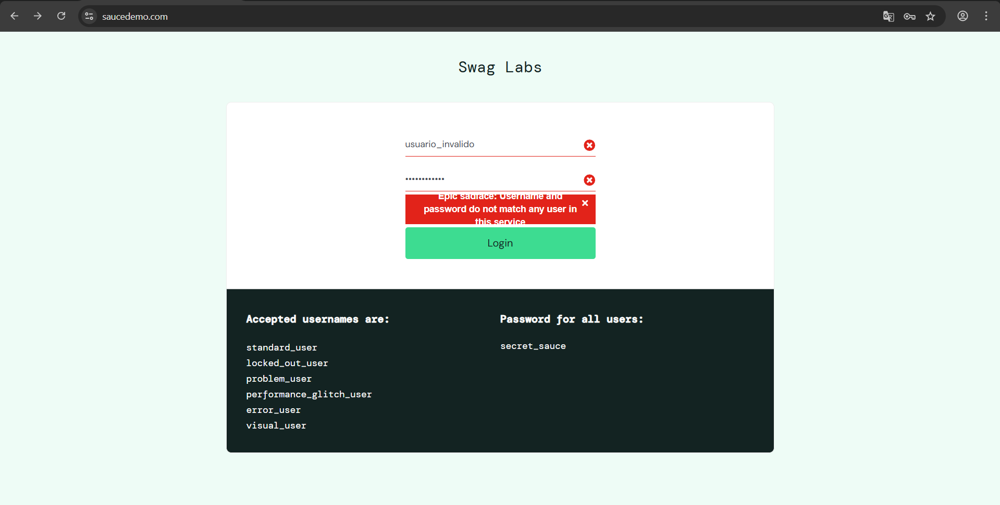

## Status
Aprovado com observação

# CT-003 — Login com senha inválida

## Prioridade
Alta

## Tipo de teste
Funcional

## Pré-condição
Usuário deve estar na página de login do SauceDemo.

## Passos
1. Inserir usuário válido "standard_user"
2. Inserir senha inválida "senha_invalida"
3.  Clicar no botão "Login"

## Resultado esperado
O sistema deve impedir o acesso e exibir uma mensagem de erro ao usuário.

## Resultado obtido
O sistema impediu o acesso corretamente e exibiu a mensagem de erro esperada.

Foi identificado o mesmo problema visual de CT-002.
Bug relacionado: BUG-001

## Evidência

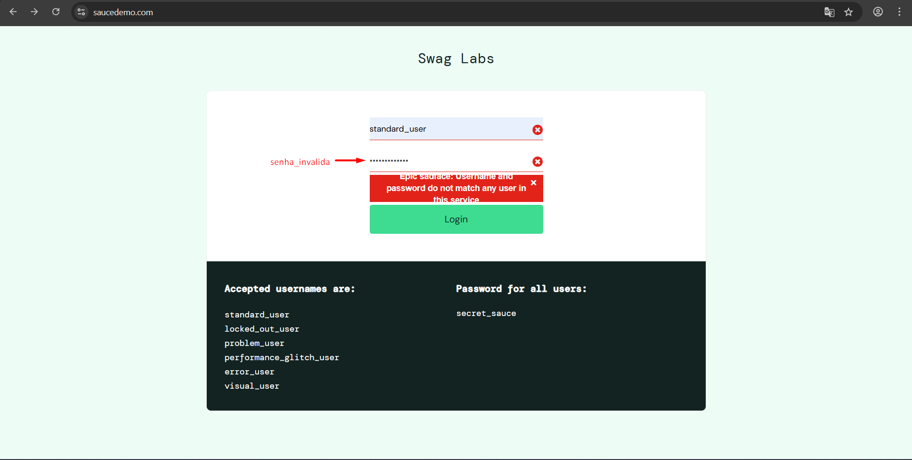

## Status
Aprovado com observação

# CT-004 — Login com campos vazios

## Prioridade
Alta

## Tipo de teste
Validação

## Pré-condição
Usuário deve estar na página de login do SauceDemo.

## Passos
1. Deixar os campos de usuário e senha vazios
2. Clicar no botão "Login"

## Resultado esperado
O sistema deve impedir o acesso e exibir uma mensagem informando que os campos devem ser preenchidos.

## Resultado obtido
O sistema impediu o acesso e exibiu mensagem de erro corretamente.

## Evidência

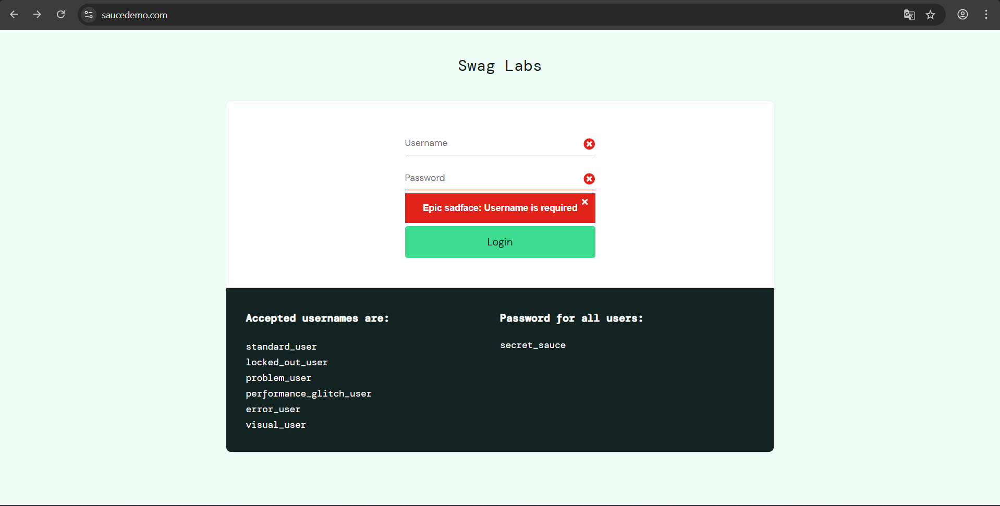

## Status
Aprovado

# Produtos

# CT-005 — Visualizar detalhes de um produto

## Prioridade
Média

## Tipo de teste
Funcional

## Pré-condição
Usuário logado no sistema e na página de produtos.

## Passos
1. Clicar no nome ou imagem de um produto
2. Verificar a página de detalhes do produto

## Resultado esperado
O sistema deve exibir corretamente a página de detalhes do produto selecionado.

## Resultado obtido
A página de detalhes do produto foi exibida corretamente com as informações esperadas.

## Evidência

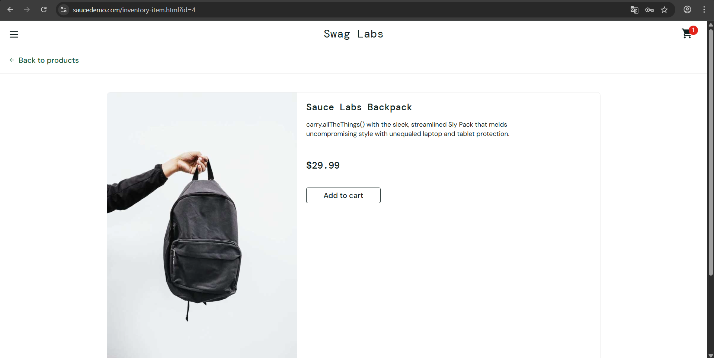

## Status
Aprovado

# CT-006 — Ordenar produtos pelo filtro

## Prioridade
Média

## Tipo de teste
Funcional

## Pré-condição
Usuário logado no sistema e na página de produtos.

## Passos
1. Clicar no filtro de ordenação
2. Selecionar uma opção de ordenação
3. Verificar a ordem dos produtos exibidos

## Resultado esperado
Os produtos devem ser exibidos na ordem correspondente ao filtro selecionado.

## Resultado obtido
Os produtos foram ordenados corretamente de acordo com o filtro selecionado.

## Evidência

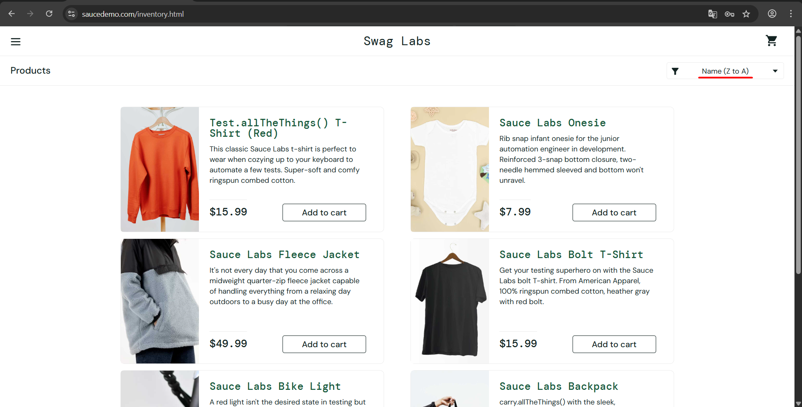

## Status
Aprovado

# CT-007 — Adicionar produto ao carrinho

## Prioridade
Alta

## Tipo de teste
Funcional

## Pré-condição
Usuário logado no sistema e na página de produtos.

## Passos
1. Clicar no botão "Add to cart" de um produto
2. Verificar o ícone do carrinho

## Resultado esperado
O botão deve mudar para "Remove" (cor vermelha), a quantidade de itens deve ser atualizada no ícone do carrinho e produto deve aparecer no carrinho.

## Resultado obtido
O sistema funcionou como esperado.

## Evidência

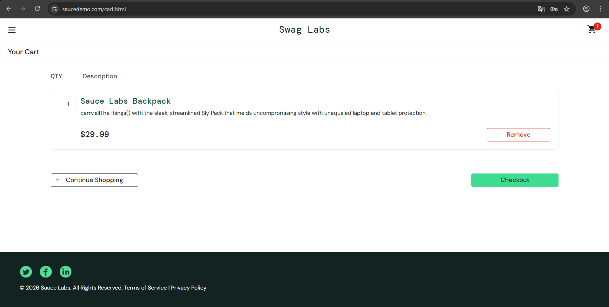

## Status
Aprovado

# CT-008 — Remover produto do carrinho

## Prioridade
Alta

## Tipo de teste
Funcional

## Pré-condição
Usuário logado no sistema com um produto adicionado ao carrinho

## Passos
1. Clicar no botão "Remove" de um produto adicionado ao carrinho
2. Verificar ícone do carrinho

## Resultado esperado
O produto deve ser removido do carrinho e a quantidade de itens deve ser atualizada no ícone do carrinho.

## Resultado obtido
O produto foi removido corretamente e o ícone do carrinho foi atualizado.

## Evidência

## Status
Aprovado

# Carrinho

# CT-009 — Visualizar produtos no carrinho

## Prioridade
Alta

## Tipo de teste
Funcional

## Pré-condição
Usuário logado no sistema com pelo menos um produto adicionado ao carrinho.

## Passos
1. Clicar no ícone do carrinho
2. Verificar os produtos exibidos no carrinho

## Resultado esperado
O sistema deve exibir corretamente os produtos adicionados ao carrinho.

## Resultado obtido
Os produtos adicionados ao carrinho foram exibidos corretamente.

## Evidência

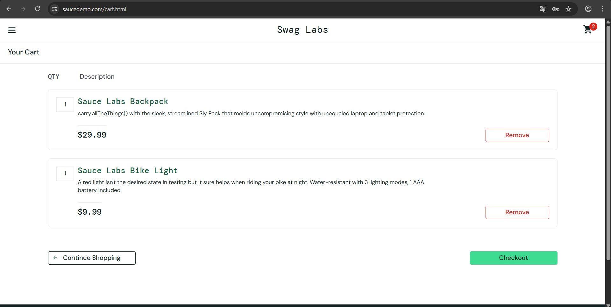

## Status
Aprovado

# CT-010 — Remover item do carrinho

## Prioridade
Alta

## Tipo de teste
Funcional

## Pré-condição
Usuário logado no sistema com pelo menos um produto no carrinho.

## Passos
1. Clicar no ícone do carrinho para acessá-lo
2. Clicar no botão "Remove" de um produto
3. Verificar os itens exibidos no carrinho

## Resultado esperado
O produto deve ser removido do carrinho corretamente.

## Resultado obtido
O produto foi removido corretamente do carrinho.

## Evidência

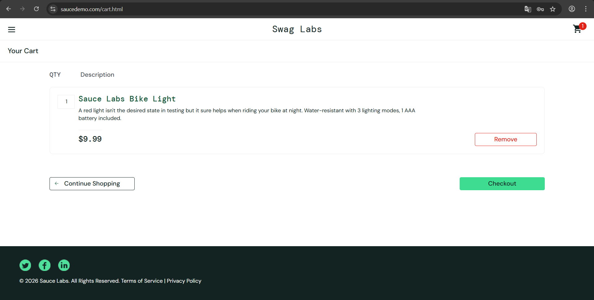

## Status
Aprovado

# CT-011 — Continuar comprando pelo carrinho

## Prioridade
Média

## Tipo de teste
Funcional

## Pré-condição
Usuário logado no sistema e na página do carrinho.

## Passos
1. Clicar no botão "Continue Shopping"
2. Verificar a navegação para a página de produtos
3. Verificar se os itens permanecem no carrinho

## Resultado esperado
O sistema deve retornar à página de produtos mantendo os itens adicionados no carrinho.

## Resultado obtido
O sistema retornou corretamente para a página de produtos e os itens permaneceram no carrinho.

## Evidência

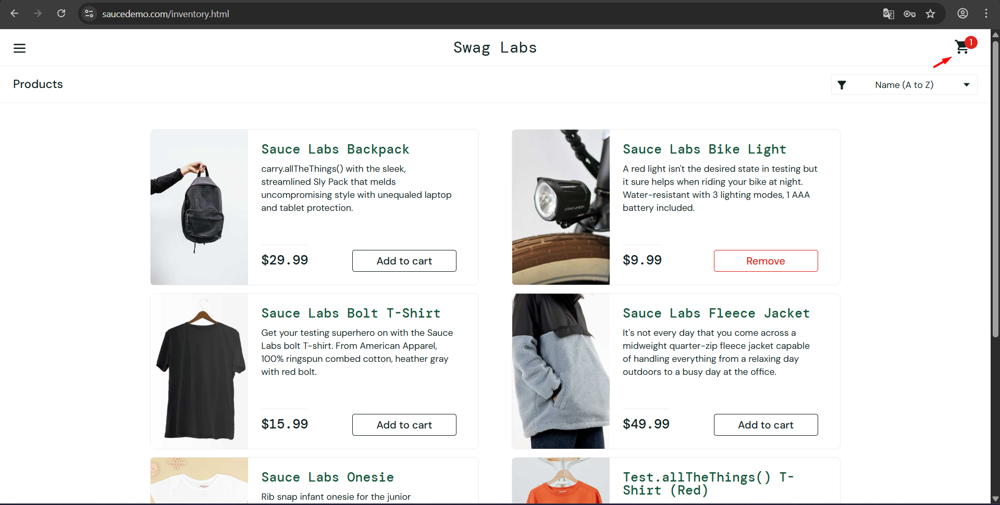

## Status
Aprovado

# Checkout 

# CT-012 — Checkout com carrinho vazio

## Prioridade
Alta

## Tipo de teste
Funcional

## Pré-condição
Usuário logado no sistema sem produtos no carrinho.

## Passos
1. Acessar o carrinho vazio
2. Tentar iniciar o checkout

## Resultado esperado
O sistema não deve permitir iniciar o checkout com o carrinho vazio.

## Resultado obtido
O sistema permitiu iniciar o checkout mesmo sem produtos no carrinho.

Bug relacionado: BUG-002.

## Evidência

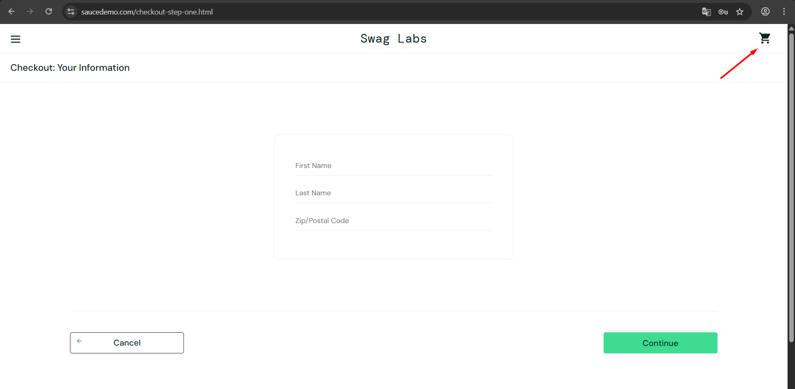

## Status
Reprovado

# CT-013— Checkout com dados válidos

## Prioridade
Alta

## Tipo de teste
Funcional

## Pré-condição
Usuário logado no sistema com pelo menos um produto no carrinho.

## Passos
1. Clicar no ícone do carrinho
2. Clicar no botão "Checkout"
3. Preencher os campos corretamente
4. Clicar no botão "Continue"

## Resultado esperado
O sistema deve avançar corretamente para a próxima etapa do checkout.

## Resultado obtido
O sistema avançou corretamente para a próxima etapa do checkout.

## Evidência

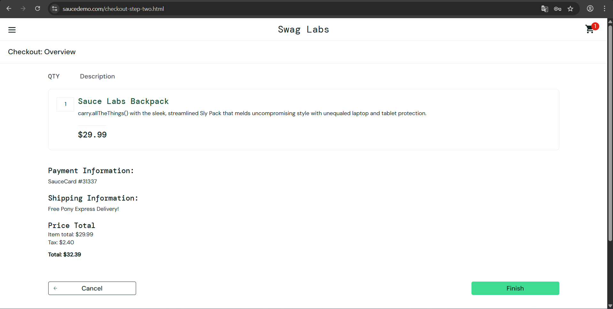

## Status
Aprovado

# CT-014 — Checkout com campos vazios

## Prioridade
Alta

## Tipo de teste
Validação

## Pré-condição
Usuário logado no sistema com pelo menos um produto no carrinho.

## Passos
1. Clicar no ícone do carrinho
2. Clicar no botão "Checkout"
3. Não preencher os campos
4. Clicar no botão "Continue"

## Resultado esperado
O sistema deve impedir o avanço para a próxima etapa e exibir mensagem de erro.

## Resultado obtido
O sistema impediu o avanço corretamente e exibiu mensagem de erro.

## Evidência

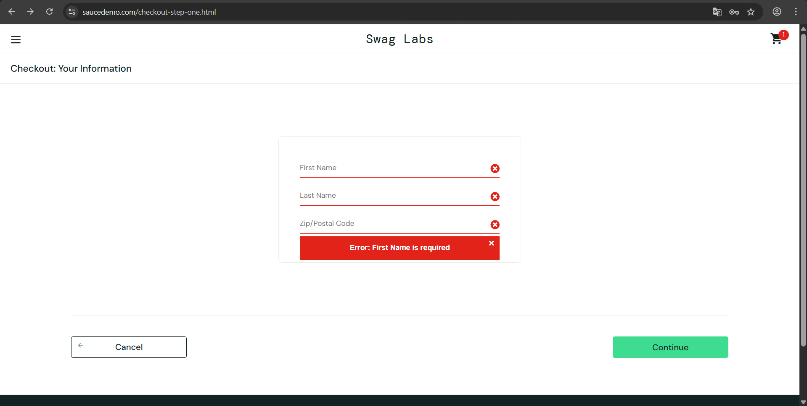

## Status
Aprovado

# CT-015 — Cancelar checkout

## Prioridade
Média

## Tipo de teste
Funcional

## Pré-condição
Usuário deve estar logado no sistema e na página do carrinho

## Passos
1. Clicar no botão "Checkout"
2. Clicar no botão "Cancel"

## Resultado esperado
O sistema deve cancelar o checkout e retornar para a página anterior.

## Resultado obtido
O checkout foi cancelado corretamente e o sistema retornou para a página anterior.

## Evidência

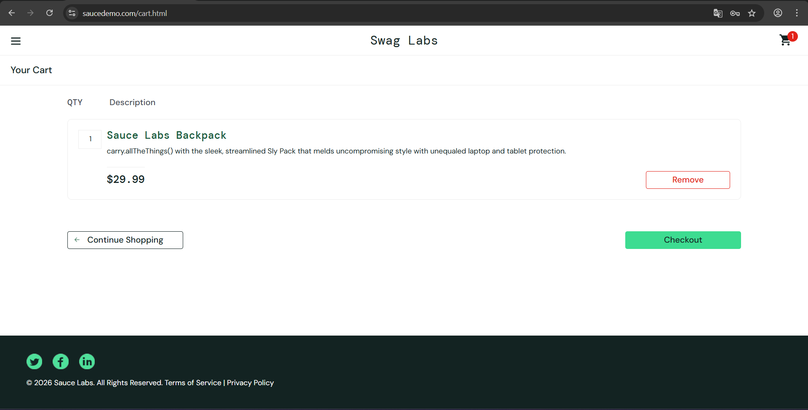

## Status
Aprovado

# CT-016 — Finalizar compra

## Prioridade
Alta

## Tipo de teste
Funcional

## Pré-condição
Usuário logado no sistema com produtos no carrinho e na etapa final do checkout.

## Passos
1. Revisar as informações da compra
2. Clicar no botão "Finish"
3. Verificar a conclusão da compra

## Resultado esperado
O sistema deve finalizar a compra e exibir a confirmação do pedido.

## Resultado obtido
A compra foi finalizada corretamente e a confirmação do pedido foi exibida.

## Evidência

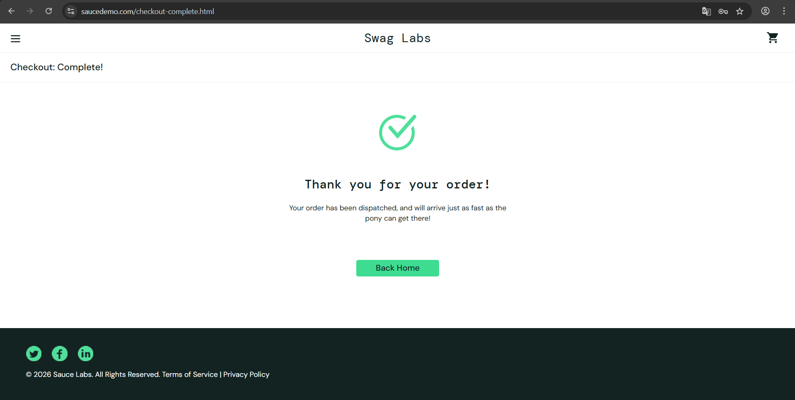

## Status
Aprovado

# Logout

# CT-017 — Realizar logout pelo menu lateral

## Prioridade
Alta

## Tipo de teste
Funcional

## Pré-condição
Usuário logado no sistema.

## Passos
1. Clicar no ícone de menu
2. Clicar na opção "Logout" no menu lateral

## Resultado esperado
O sistema deve encerrar a sessão do usuário e retornar para a tela de login.

## Resultado obtido
O sistema encerrou a sessão do usuário e retornou para a tela de login corretamente.

## Evidência

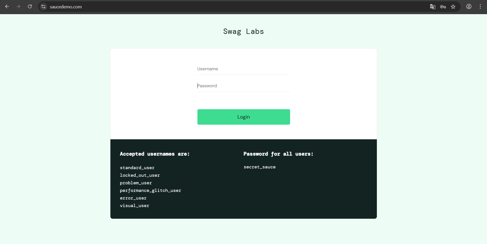

## Status
Aprovado
