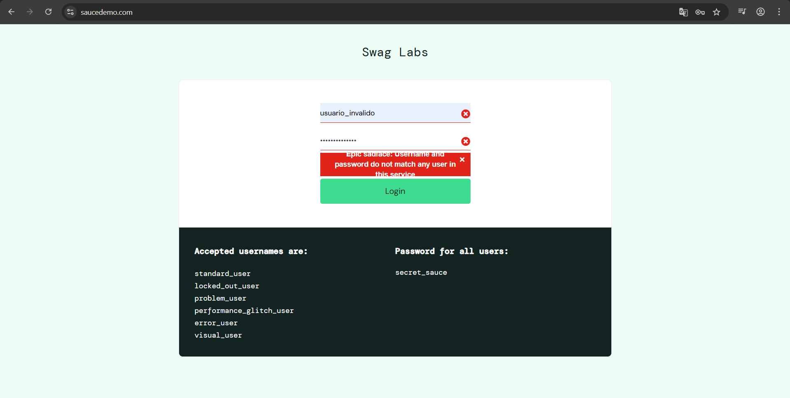
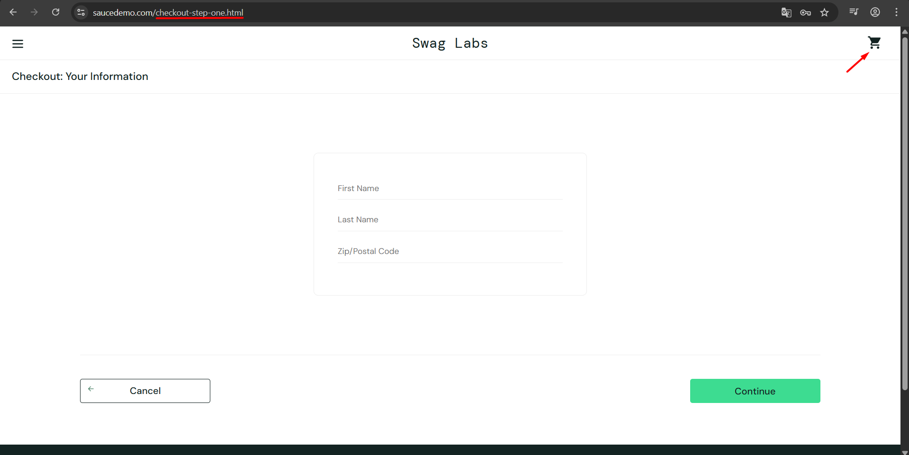

# Relatório de Bugs — SauceDemo

## Objetivo
Documentar os bugs identificados durante a execução dos testes manuais no sistema SauceDemo.

---

# BUG-001 — Mensagem de erro ultrapassando o container

## Tipo de bug
Interface

## Severidade
Baixa

## Prioridade
Baixa

## Ambiente
- Navegador: Google Chrome
- Sistema Operacional: Windows 11

## Passos para reproduzir
1. Inserir credenciais inválidas
2. Clicar no botão "Login"

## Resultado esperado
A mensagem de erro deve permanecer dentro do container vermelho corretamente alinhada.

## Resultado obtido
A mensagem de erro ultrapassa os limites do container vermelho.

## Status
Aberto

## Evidência

---

# BUG-002 — Checkout permitido com carrinho vazio

## Tipo de bug
Funcional

## Severidade
Média

## Prioridade
Média

## Ambiente
- Navegador: Google Chrome
- Sistema Operacional: Windows 10

## Passos para reproduzir
1. Realizar login no sistema
2. Acessar o carrinho vazio
3. Tentar iniciar o checkout

## Resultado esperado
O sistema não deve permitir iniciar checkout sem produtos no carrinho.

## Resultado obtido
O sistema permitiu iniciar o checkout mesmo sem produtos adicionados.

## Status
Aberto

## Evidência

